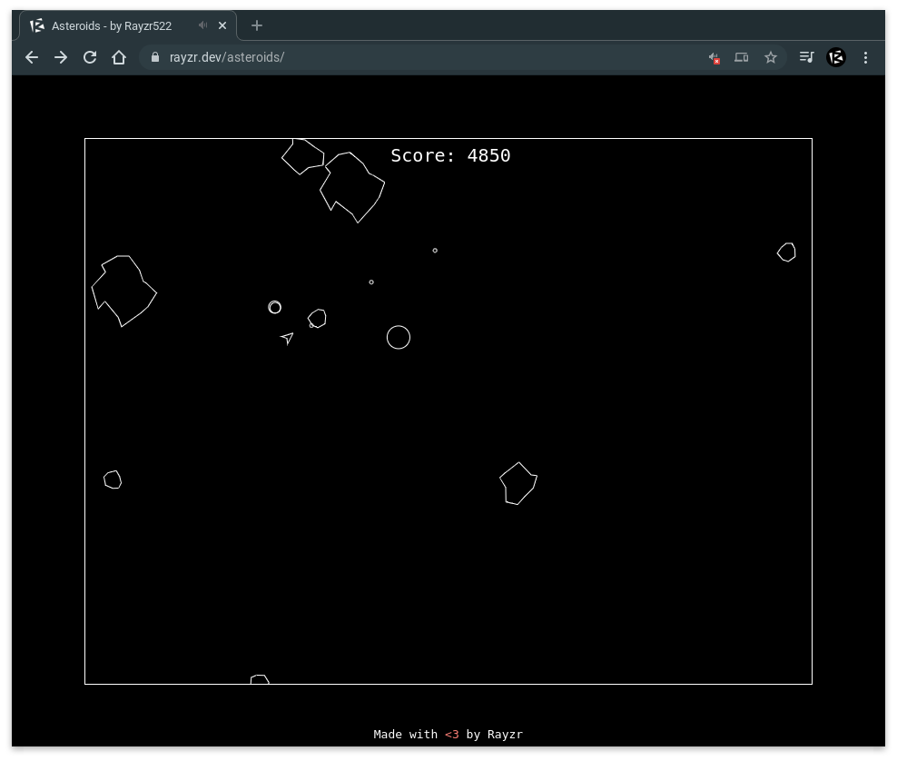

  

# Asteroids

> A fun little recreation of the classic Asteroids game in 100% vanilla JavaScript

### [Play it now!](https://rayzr.dev/asteroids)

I honestly just sat down and felt like making this. In total, between far more playtesting than I'd like to admit and the development itself, I spent just under 4 hours on this. All resources are 100% made by me, from audio to "graphics" (although no images are used).

While I am aware that my code is not exactly the cleanest, this was a personal exercise for myself in problem solving under time constraints. Too often I overcomplicate things to the point that they are unmanageable. In this situation, I simply decided I would keep writing more lines of code until it worked, rather than coming up with a plan and abstracting all the complicated bits away. And yes, the fact that the file is 420 lines long is very much intentional.

On a side note, I also made a fun little AI that plays the game pretty well (got a score of just above 20k once, if I remember correctly): https://gist.github.com/Rayzr522/142b8e60a87ab7c434f47370f5fb875c

Just paste it in your browser's developer console and it'll start playing :)

## Features

- Randomized asteroid shapes
- Score counter
- Effects such as explosions and screen shake
- Sound effects
- Breathtaking 4K graphics
- Ultra highly optimized performance using latest cutting edge technologies
- Did I mention the amazing graphics?
- True retro vibe with nothing but black and white on the entire web page
- Lots of tweakable settings for those of you who know how to use a dev console :)

If you have any suggestions for additions or you have an issue to report, please [create an issue report](https://github.com/Rayzr522/Asteroids/issues/new). Thanks!
